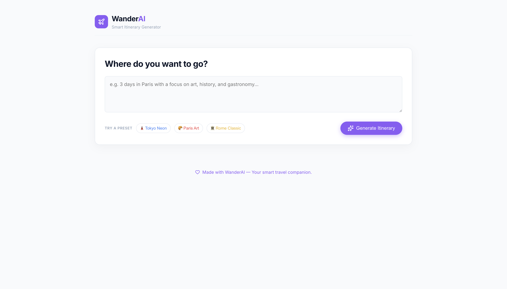
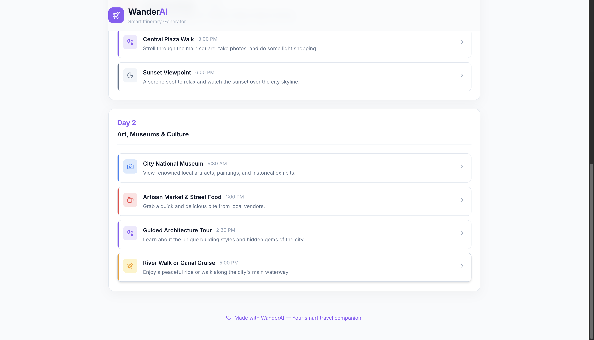
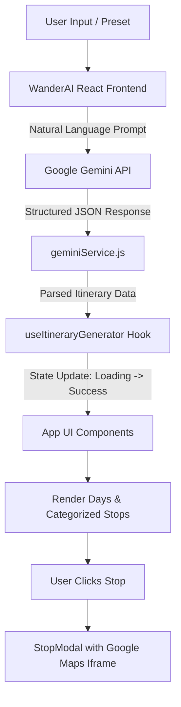

# WanderAI - Smart Itinerary Generator

WanderAI is an intelligent, premium SaaS-style itinerary generator powered by Google's Gemini AI. It creates beautifully structured, day-by-day travel plans based on natural language prompts.

## 📸 Screenshots

*Note: Please add your screenshots to the repository and name them `screenshot1.png`, `screenshot2.png`, etc., or update these paths to point to your image files.*

| Dashboard | Generated Itinerary |
| :---: | :---: |
|  |  |

| Stop Details | Map Modal |
| :---: | :---: |
|  |  |

## 🏗️ Working Diagram



## 🚀 Setup

1. **Clone the repository:**
   ```bash
   git clone https://github.com/aashutosh-k-das/Tripe-Planner.git
   cd "Trip Planner"
   ```

2. **Install dependencies:**
   ```bash
   npm install
   ```

3. **Configure Environment:**
   You can run the app without an API key using the built-in mock fallback mode. To use live AI generation, you'll need a Google Gemini API key.
   - Create a `.env` file in the root directory:
     ```env
     VITE_GEMINI_API_KEY=your_api_key_here
     ```

4. **Run the development server:**
   ```bash
   npm run dev
   ```

## 💡 Usage

1. Open the application in your browser (usually `http://localhost:5173`).
2. Type your travel destination and preferences into the input box (e.g., "3 days in Paris with a focus on art and food") or select a quick Preset.
3. Click **Generate Itinerary**.
4. Browse your beautifully formatted, day-by-day itinerary with categorized stops.
5. Click on any specific stop to open a modal with more details and an interactive Google Map of the location.

## 🤖 AI-Usage Note

This project leverages the **Google Gemini API** (`@google/generative-ai`) to transform natural language into highly structured JSON data. 
- **Prompt Engineering**: The application uses a strictly defined JSON schema in its system prompt to ensure the AI always returns parseable, consistent data (days, stops, categories, times, and map search queries).
- **Fallback Mode**: If the API key is missing or the quota is exceeded, the application gracefully degrades to a premium mock response so the UI and layout can still be evaluated without errors.

## ⚠️ Limitations

- **Map Accuracy**: The embedded Google Maps use a generic search query based on the AI-generated location name. For highly specific or obscure places, the map might occasionally default to a general city view.
- **AI Hallucinations**: As with all LLMs, Gemini may occasionally suggest places that are permanently closed, or hallucinate travel times between locations.
- **Client-Side API Key**: Currently, the Gemini API key is loaded on the client side via `.env` for demonstration purposes. In a real-world production environment, this logic should be moved to a secure backend endpoint to prevent exposing the API key to the public.

## ⏱️ Time Spent

- **UI/UX Design & CSS Styling**: ~2 hours
- **React Component Architecture & State Management**: ~1.5 hours
- **Gemini AI Integration & Prompt Engineering**: ~1 hour
- **Total Estimated Time**: ~4.5 hours
